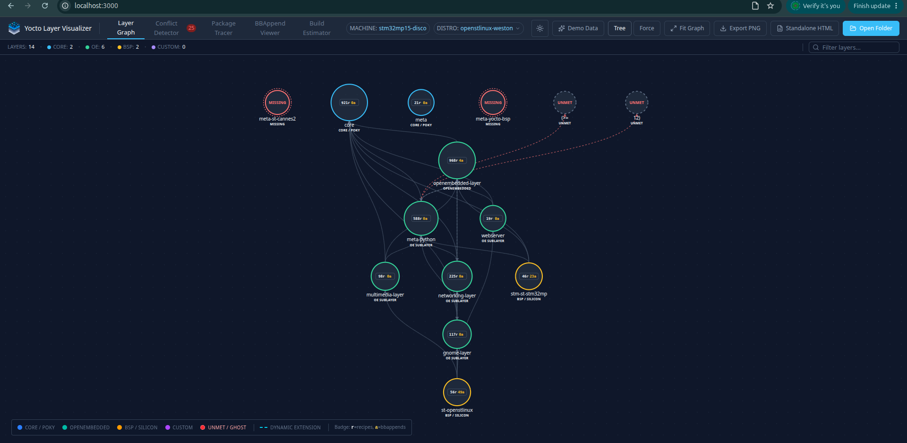
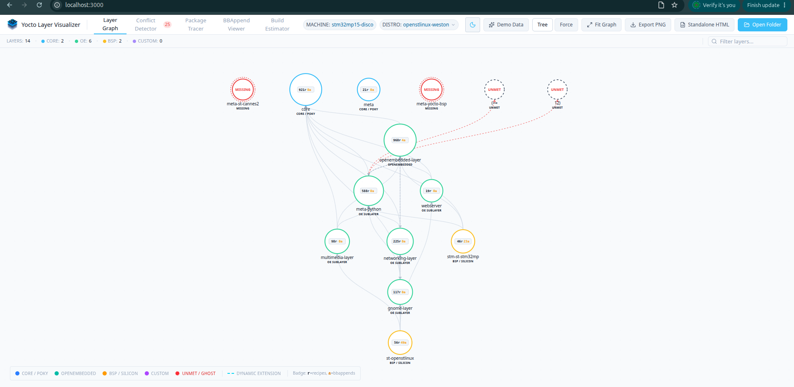
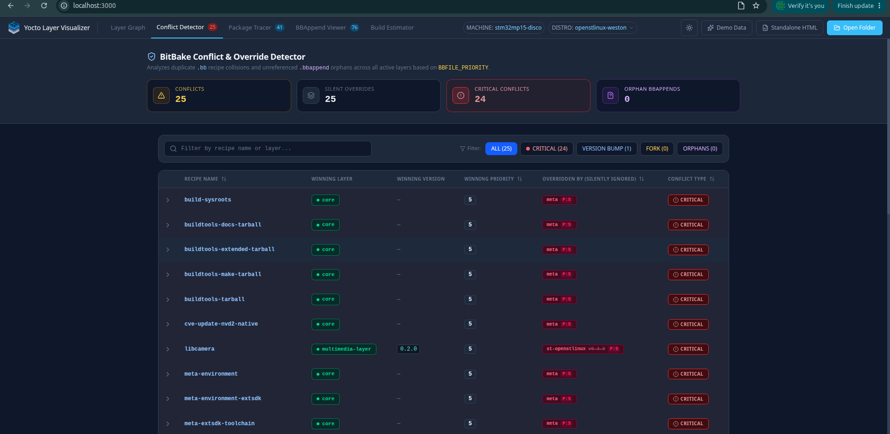
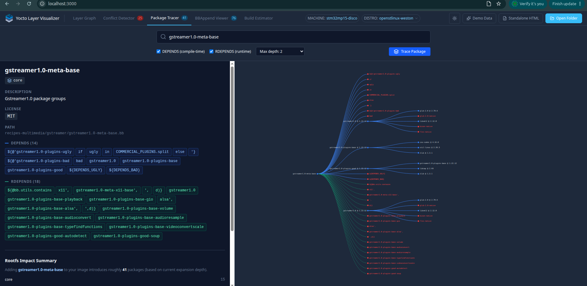
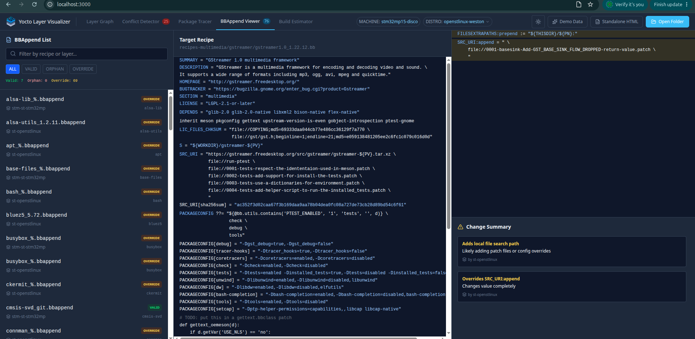
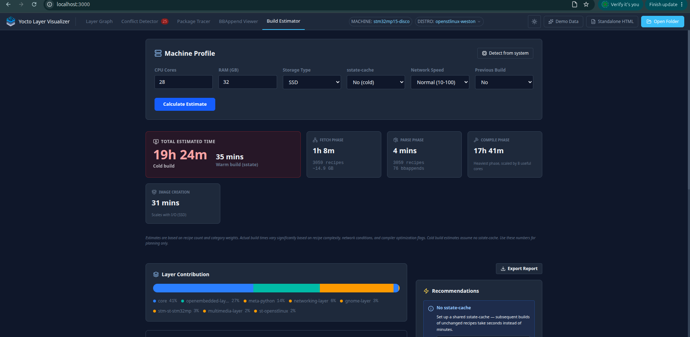

# YoctoVisualizer

A browser-based interactive visualizer for Yocto Project build stacks.
Drop your Yocto workspace folder and instantly see your layer dependency
graph, recipe conflicts, package chains, bbappend overrides, and build
time estimates — all parsed from your real config files with zero setup.



---

## Why this exists

Yocto is the standard for embedded Linux. It powers automotive ECUs,
medical devices, industrial controllers, and consumer electronics at
scale. But the entire build stack is defined in text files scattered
across dozens of directories. The relationships between layers, which
recipes conflict, what a package pulls into your rootfs — none of this
is visible anywhere without running a full build first.

YoctoVisualizer makes it visible. Open your workspace folder and see
your entire build stack as an interactive graph in seconds.

---

## Features

**Layer Graph**
- D3 force-directed and hierarchical tree layouts
- Parses real `bblayers.conf` with full BitBake variable expansion
  (`${OEROOT}`, `+=`, `=+`, compound operators)
- Handles ST-generated configs, vanilla Poky, and everything in between
- Ghost nodes for missing and unmet dependencies
- Auto-discovers layers without `bblayers.conf` by scanning for
  `layer.conf` files
- Supports `BBFILE_COLLECTIONS` with `_COLLECTIONNAME` suffix convention
- Dynamic extension edges from `BBFILES_DYNAMIC`

**Conflict Detector**
- Finds every `BBFILE_PRIORITY` clash across active layers
- Categorizes conflicts: CRITICAL (equal priority), VERSION BUMP, FORK
- Detects orphan bbappends targeting recipes not in active layers
- Expandable rows showing full file paths and which layer wins

**Package Tracer**
- Type any recipe name — traces full `DEPENDS` and `RDEPENDS` chains
- D3 collapsible tree with compile-time vs runtime edge distinction
- Rootfs impact summary — every package that lands in the image
- Recipe index built from real `.bb` files across all active layers

**BBAppend Viewer**
- Lists all `.bbappend` files grouped by layer
- Side-by-side view of original recipe and bbappend contents
- Syntax highlighted BitBake — variable assignments, functions, comments
- Auto-categorizes changes: SRC_URI additions, DEPENDS changes,
  function overrides, PACKAGECONFIG modifications
- Flags orphan bbappends and recipes patched by multiple layers

**Build Estimator**
- Estimates cold and warm build times from real recipe count and
  category breakdown
- Phase breakdown: fetch, parse, compile, image creation
- Layer contribution chart
- Generates optimized `local.conf` snippet for your machine profile
- Actionable recommendations based on your hardware and layer stack

---

## Tested with

| Stack | Recipes | BBAppends |
|---|---|---|
| OpenSTLinux scarthgap `openstlinux-6.6-yocto-scarthgap-mpu-v24.11.06` | 3,059 | 76 |
| `meta-raspberrypi` standalone | 50 | 29 |
| vanilla `openembedded-core` | 921 | 0 |

---

## Getting started

### Browser (Chrome or Edge only)

The folder picker uses the File System Access API which is only
available in Chromium-based browsers.

```bash
git clone https://github.com/dep-omen/YoctoVisualizerTool.git
cd YoctoVisualizerTool
npm install
npm run dev
```

Open `http://localhost:3000` in Chrome or Edge.
Click **Open Folder** and select your Yocto project root.

### Electron (any OS, no browser restriction)

```bash
npm run electron
```

Or build a distributable:

```bash
npm run build
npm run electron:build
```

---

## What to open

The tool expects your Yocto project root — the folder that contains
your `build/` directory (or directly contains `conf/bblayers.conf`).

**For OpenSTLinux:**
```bash
# After repo sync
source layers/meta-st/scripts/envsetup.sh
# Select your machine and build directory
# Then open the workspace root in YoctoVisualizer
```

**For vanilla Poky:**
```bash
source poky/oe-init-build-env build
# Then open the workspace root in YoctoVisualizer
```

**For a standalone layer clone** (no bblayers.conf):
Just open the cloned layer folder directly. The tool auto-discovers
all `layer.conf` files and builds the graph from what it finds.

---

## Stack

- React 19 + Vite + TypeScript
- Tailwind CSS
- D3.js v7
- Electron (desktop wrapper)
- File System Access API (browser mode)

---

## Screenshots

**Dark theme — OpenSTLinux scarthgap STM32MP157**


**Light theme**


**Conflict Detector — 25 conflicts found in real ST stack**


**Package Tracer — gstreamer1.0-meta-base pulling 41 packages**


**BBAppend Viewer — ST overrides on gstreamer**


**Build Estimator — 19h 24m cold build on 28-core machine**


---

## Contributing

Issues and PRs welcome. The parsing logic lives in `src/utils/` —
`fileSystemScanner.ts`, `yoctoParser.ts`, and `recipeParser.ts`.
If you have a real `bblayers.conf` that breaks the parser, open an
issue and paste the relevant section.

---

## License

MIT